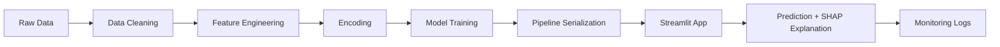

# 🏠 Ames Housing Price Predictor

An end-to-end machine learning pipeline for predicting house prices with full model interpretability and a production-ready deployment.

## 📋 Project Overview

This project demonstrates a complete **Machine Learning Engineering** workflow:
- **Data cleaning & feature engineering** with domain-specific logic
- **Model training & hyperparameter tuning** using Random Forest
- **Model interpretability** with SHAP values for explainable AI
- **Production deployment** with a Streamlit web application
- **Model monitoring** with prediction logging and drift detection

**Live Demo**: [Streamlit App Link](https://abduldatawork-ames-housing-predictor.hf.space) | **Video Walkthrough**: [YouTube Explanation](https://youtu.be/kGxnFCRvXiQ)

## 🎯 Business Problem

Real estate pricing involves numerous factors that interact in complex ways. This tool helps:
- **Home buyers/sellers** estimate property values
- **Real estate agents** quickly price listings
- **Appraisers** validate their assessments
- **Data scientists** learn end-to-end ML deployment

## 🏗️ Architecture

